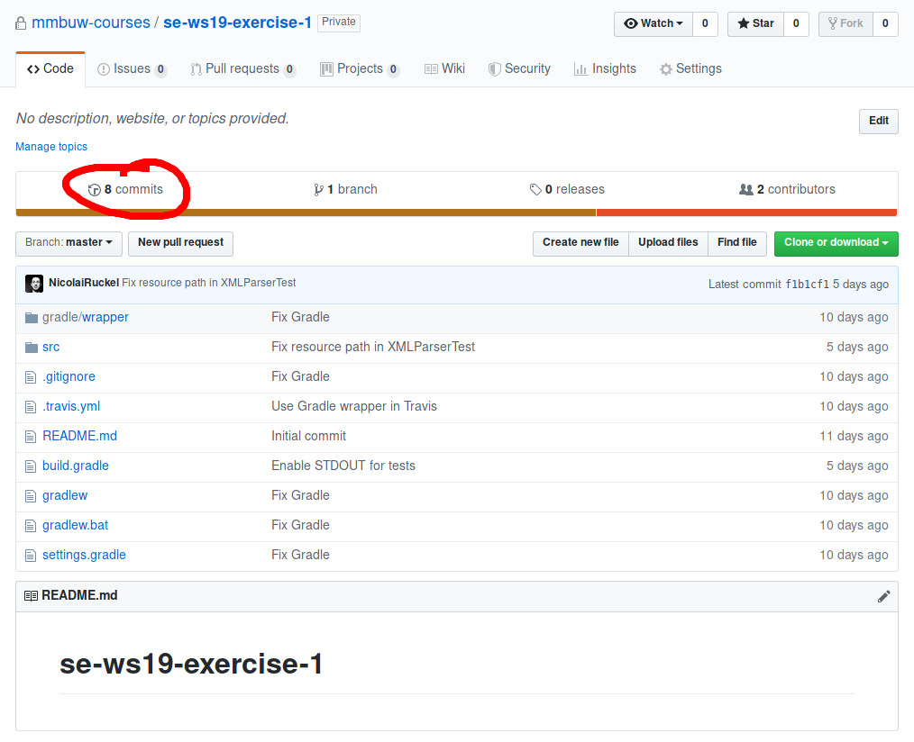
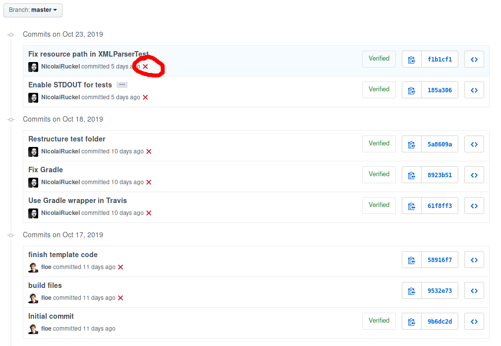
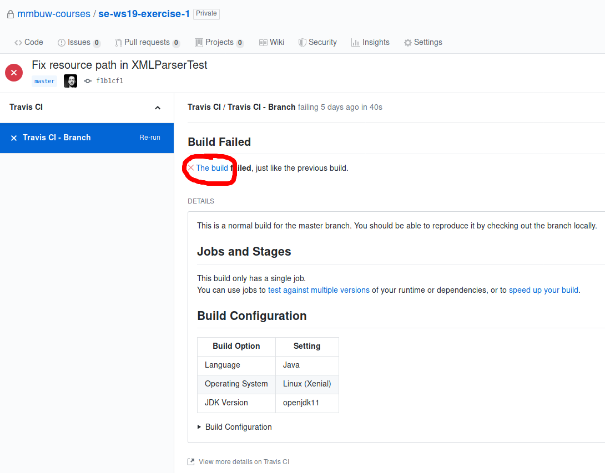
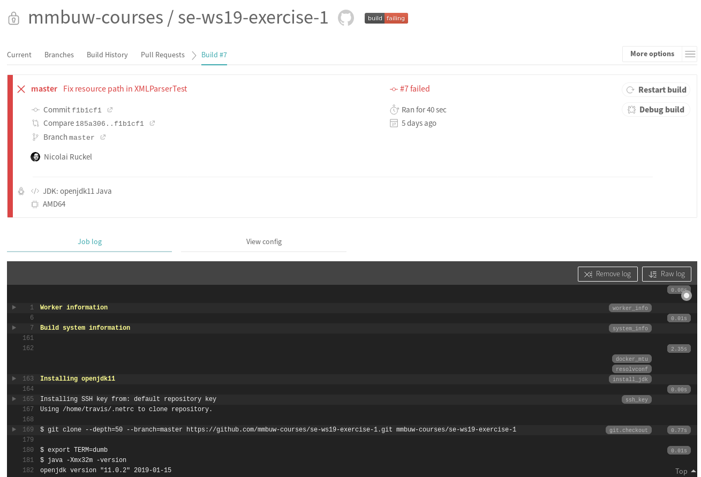

# Software Engineering WS 2019 — Exercise 3
Starter code for the Software Engineering Exercise.

- [Compiling and Running the Tests](#compiling-and-running-the-tests)
- [Tests](#tests)
- [Travis CI](#travis-ci)
- [Updating the Starter Code](#updating-the-starter-code)

## Compiling and Running the Tests
To compile your code and run the tests, run one of the following commands.

On macOS, Linux, or the Git Bash of [Git for Windows][gitforwindows]:

    ./gradlew build

In the Windows Powershell:

    gradlew.bat build

After running this command you can find an overview over your test results in
`build/reports/tests/test/index.html`.

## Tests
We provided some [tests](src/test/java/exercise/). Those tests *must* pass,
otherwise you won’t get full points for this exercise. The tests also show the
function signatures of functions you have to implement in this exercise.

### XML Parser Test
The [tests for the XML parser](src/test/java/exercise/XMLParserTest.java) will
call your implemented functions with some test files. This way you can check if
your implementation works. These tests are run automatically with `gradle
build`.
You can find the test files in [`src/test/resources`](src/test/resources).

## Travis CI
Travis CI will automatically compile the code you committed to the repository
and run the tests. To see the result, open the web page of your repository and
click on *commits*:

Then you will see an overview of your commits. Next to each commit you will see
the Travis CI result: Either a green tick if everything could be compiled and no
errors occurred, or a red cross otherwise. You can click on that symbol to see
more details.

Click on *The build* to get to the output of Travis CI.

On the bottom you can see the output log, which will show you the error messages
(if there were any).

Make sure that your code also runs on Travis CI, otherwise you won’t get all
points for you solution. Keep in mind that tests can just tell you if they found
a problem but not that there are no problems, i.e. just because all tests run
doesn’t mean your code is correct.

## Updating the Starter Code
In case we provide bug fixes later, you have to merge them manually into your
code. To do this add the repository of the starter code as a
[remote][git-remote]:

    git remote add https://github.com/mmbuw-courses/se-ws19-exercise-$NUMBER.git

Where `$NUMBER` corresponds the exercise’s number, i.e. for the first assignment
the URL is `https://github.com/mmbuw-courses/se-ws19-exercise-1.git`.
You only have to do this once for each assignment.
After you did that you can pull the changes we made in the starter code with:

    git pull upstream master

Pay attention to Git’s output, you may have to fix some [merge
conflicts][git-merge-conflicts].

[gitforwindows]: https://gitforwindows.org/
[git-remote]: https://git-scm.com/docs/git-remote
[git-merge-conflicts]: https://git-scm.com/docs/git-merge#_how_conflicts_are_presented
